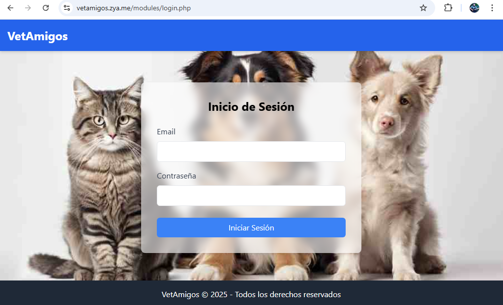

# 🐾 Sistema de Gestión Veterinaria - VetAmigos  


Sistema web para gestión de veterinarias desarrollado como proyecto académico de la materia Metodología de Sistemas I de la Tecnicatura Universitaria en Programación cursada en la Universidad Tecnológica Nacional – Facultad Regional Resistencia - Subsede Formosa. Permite registrar mascotas, agendar turnos, enviar recordatorios, consultar historial de visitas y gestionar adopciones.

## ✨ Características Principales  
- **Autenticación de usuarios** con roles (Veterinario/Administrativo)  
- **CRUD completo** de mascotas y dueños  
- **Agendamiento inteligente** de turnos médicos  
- **Sistema de recordatorios** para vacunaciones  
- **Módulo de adopciones** integrado  
- **Historial clínico** de visitas  
- **Interfaz responsive** con Tailwind CSS  
- **Despliegue gratuito** en hosting compatible  

## 🚀 Instalación Rápida  
### Requisitos Previos  
- Hosting con soporte para PHP 8.0+ y MySQL (Se puede utilizar XAMPP para pruebas)
- Acceso a phpMyAdmin o cliente MySQL  
- Git (opcional)  

### Pasos de Instalación  
1. **Clonar repositorio:**  
```bash
git clone https://github.com/tuusuario/vetamigos.git
```
2. **Importar base de datos:**
- Crear BD en phpMyAdmin
- Ejecutar vetamigos_db.sql de la carpeta includes.
3. **Configurar conexión:**
Editar includes/database.php con tus credenciales:
```php
$host = "localhost";
$dbname = "tu_db";
$username = "tu_usuario";
$password = "tu_password";
```
4. **Subir archivos al hosting:**
- Subir toda la carpeta via FTP (FileZilla)
- Directorio raíz: public_html / htdocs (depende del hosting)
5. **Acceder al sistema:**
- URL: https://tudominio.com 
- Mi ejemplo: http://vetamigos.zya.me

- Credenciales predeterminadas:
    - Veterinario: vet@vetamigos.com / password
    - Administrativo: admin@vetamigos.com / 1234

## 📁 Estructura del Proyecto
```text
raíz/
├── index.php                    # Redirección inicial
├── includes/                    # Funciones core
│   ├── auth.php                 # Autenticación y roles
│   ├── database.php             # Conexión MySQL
│   ├── funciones.php            # Utilidades
│   ├── header.php               # Cabecera común
│   ├── footer.php               # Pie de página
│   └── vetamigos_db.sql         # Estructura de la base de datos
└── modules/                     # Módulos de la aplicación
    ├── login.php                # Inicio de sesión
    ├── dashboard.php            # Panel principal
    ├── mascotas.php             # Gestión de mascotas
    ├── turnos.php               # Agendamiento de turnos
    ├── recordatorios.php        # Envío de recordatorios
    ├── historial.php            # Historial de visitas
    └── adopciones.php           # Gestión de adopciones
```

## Módulos Implementados
| Módulo       | Descripción                        | Acceso              |
|-------------|------------------------------------|---------------------|
| Mascotas    | Registro de mascotas y dueños     | Veterinario/Admin  |
| Turnos      | Agendamiento de consultas         | Veterinario/Admin  |
| Recordatorios | Envío de notificaciones          | Solo Veterinario   |
| Historial   | Consulta de visitas anteriores    | Veterinario/Admin  |
| Adopciones  | Gestión de adopciones             | Solo Veterinario   |

## 🔒 Seguridad
- Encriptación de contraseñas con password_hash()
- Protección contra SQL Injection usando consultas preparadas
- Validación de roles en cada módulo
- Sanitización de datos de entrada

## 👥 Usuarios de Prueba
| Rol           | Email                  | Contraseña |
|--------------|------------------------|------------|
| Veterinario  | vet@vetamigos.com       | password   |
| Administrativo | admin@vetamigos.com   | 1234       |

## 📄 Licencia
Este proyecto está bajo licencia MIT.
